# Workshop - MAAS/Juju et déployer kubernetes

Ce tutoriel utilise principalement des commandes ssh sur Linux, mais sur Windows avec Putty voici comment faire:

Clef SSH avec Putty: https://www.ssh.com/ssh/putty/windows/puttygen

Tunnel SSH : https://blog.devolutions.net/2017/4/how-to-configure-an-ssh-tunnel-on-putty


- Connectez vous avec le compte demo au MAAS qui vous ai attribué (nous vous fournirons mot de passe et hostname)

  ```
  julien@laptop:~$ ssh -o PubkeyAuthentication=no -o PreferredAuthentications=password demo@XXXXXXX.gologic.ca -p 4822
  ```
  
- Créer votre propre compte sur maas et établissez votre mot de passe, si vous avez un clef SSH rajoutée la

  ```
  demo@gustaviomaas:~$ sudo useradd -m -s /bin/bash patrick
  demo@gustaviomaas:~$ sudo passwd patrick
  Enter new UNIX password: 
  Retype new UNIX password: 
  passwd: password updated successfully
  ```

- Configurons notre ssh pour facilement se connecter avec "ssh mymaas"

  ```
  ~/.ssh/config
  Host mymaas
          Port 4822
          User XXXXX
          HostName XXXX.gologic.ca
  # Seulement si vous n'utilisez pas de clef SSH
          PubkeyAuthentication no
          PreferredAuthentications password
  ```

- Maintenant pour accèder à l'interface web du Maas qui écoute sur le port 5240 par un tunnel SSH local:

  ```
  ssh -N mymaas -L 5240:127.0.0.1:5240
  ```

  

- Nous vous fournirons vos compte/mot de passe. Une fois connectez vous verrez toutes les VMs/machines de libre ou qui vous sont attribuées.

  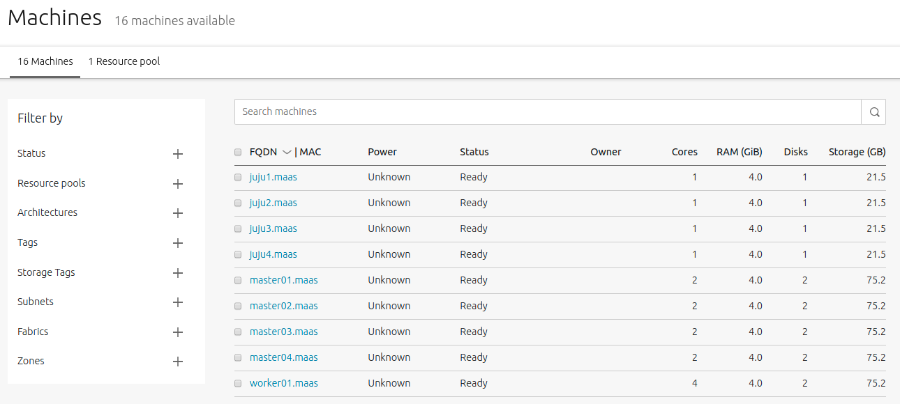
  
- Vous devez avoir au moins une clef SSH dans votre compte pour la suite

  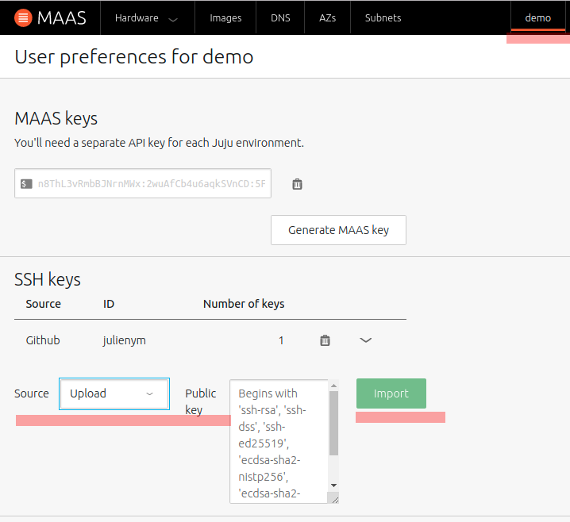
  
- Connectez vous a Maas par ssh, et rajoutons notre nouveau Cloud MAAS

  ```
  julien@gustaviomaas:~$ juju add-cloud
  Cloud Types
    lxd
    maas
    manual
    openstack
    vsphere
  
  Select cloud type: maas
  
  Enter a name for your maas cloud: gustavio-maas
  
  Enter the API endpoint url: http://192.168.48.254:5240/MAAS
  
  Cloud "gustavio-maas" successfully added
  
  You will need to add credentials for this cloud (`juju add-credential gustavio-maas`)
  before creating a controller (`juju bootstrap gustavio-maas`).
  julien@gustaviomaas:~$ 
  ```

- Il manque notre clef API que vous retrouverez dans MAAS en cliquant sur votre utilisateur:

  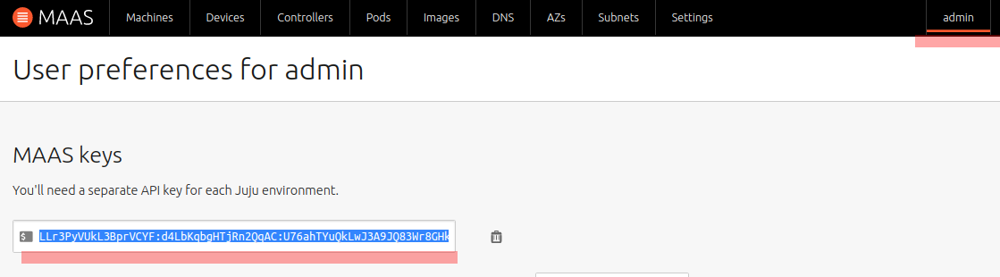

  ```
  julien@gustaviomaas:~$ juju add-credential gustavio-maas
  Enter credential name: gustavio-maas-creds
  
  Using auth-type "oauth1".
  
  Enter maas-oauth: 
  
  Credential "gustavio-maas-creds" added locally for cloud "gustavio-maas".
  
  julien@gustaviomaas:~$
  ```

- Un controller Juju peut maintenant être déployer sur une de nos machines dans MAAS. Nous pouvons aussi mentionner sur quelle machine nous voulons déployer le controller juju. Sélectionner une des VMs juju de libre.

  ```
  julien@gustaviomaas:~$ juju bootstrap gustavio-maas --to gjuju.maas
  Creating Juju controller "gustavio-maas" on gustavio-maas
  Looking for packaged Juju agent version 2.6.5 for amd64
  Launching controller instance(s) on gustavio-maas...
  ```

  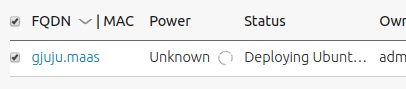

  N'oublions pas d'allumer ensuite la VM

  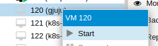

- MAAS installeras Ubuntu et Juju ira configurer le controller

  ```
  julien@gustaviomaas:~$ juju bootstrap gustavio-maas --to gjuju.maas
  Creating Juju controller "gustavio-maas" on gustavio-maas
  Looking for packaged Juju agent version 2.6.5 for amd64
  Launching controller instance(s) on gustavio-maas...
  
  - dg8dkr (arch=amd64 mem=4G cores=1)  
    Installing Juju agent on bootstrap instance
    Fetching Juju GUI 2.14.0
    Waiting for address
    Attempting to connect to 192.168.48.2:22
    Connected to 192.168.48.2
    Running machine configuration script...
    Bootstrap agent now started
    Contacting Juju controller at 192.168.48.2 to verify accessibility...
  
  Bootstrap complete, controller "gustavio-maas" now is available
  Controller machines are in the "controller" model
  Initial model "default" added
  julien@gustaviomaas:~$ 
  ```

- Le controller Juju à une interface web, retrouvons-là:

  ```
  julien@gustaviomaas:~$ juju gui
  GUI 2.14.0 for model "admin/default" is enabled at:
    https://192.168.48.2:17070/gui/u/admin/default
  Your login credential is:
    username: admin
    password: a6933655a8223098831cbd6c3d7486a7
  julien@gustaviomaas:~$ 
  ```

- Ouvrons un autre tunnel pour se connecter à l'interface web

  ```
  julien@laptop:~$ ssh -N mymaas -L 17070:192.168.48.2:17070
  ```

  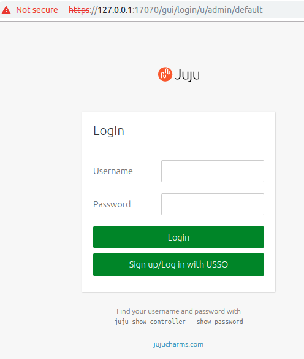

- Après s'être connecter, créeons un nouveau modèle pour notre déploiement

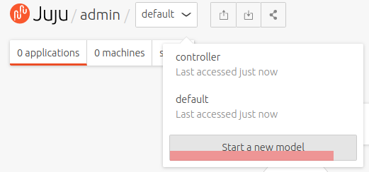

- Entrez un nom représentant ce que vous voulez faire

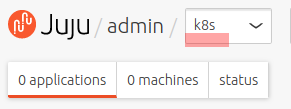

- Cliquez sur le gros + et choisissez Kubernetes-View et choisissez Kubernetes Core.

  Le fichier bundle.yaml permet de voir les contraintes (cpu/ram) que les machines ont besoins - petit truc.

  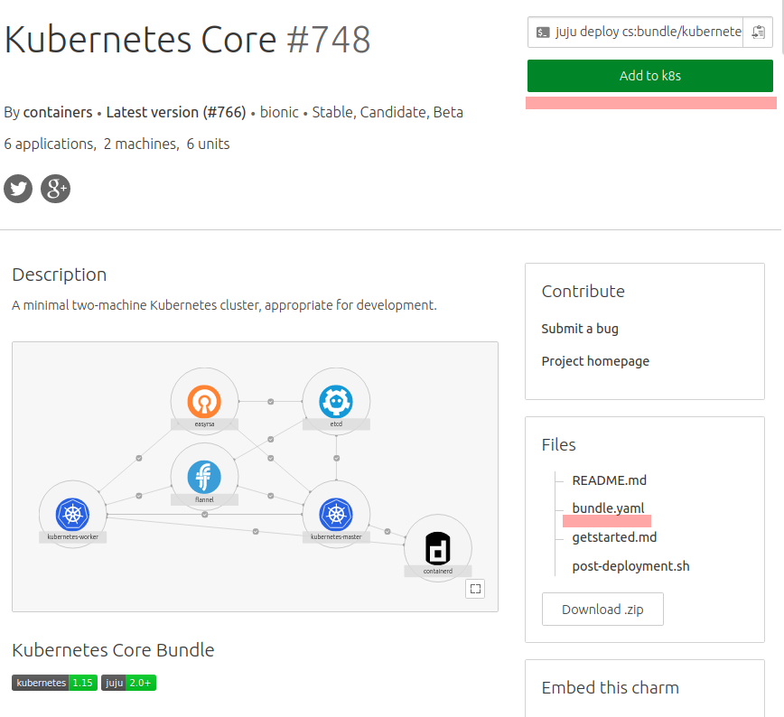

- Après l'ajout vous aurez l'option de rajouter vos clefs publiques pour les connections SSH. IMPORTANT, car vous ne pourrez pas vous connecter au master et retrouver la config k8s.

  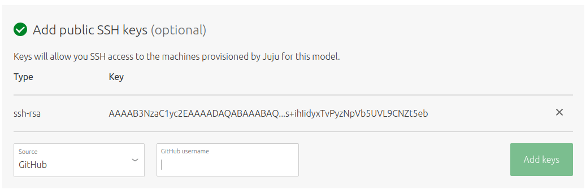

- Lorsque ajouter, Juju télécharge le bundle/charm et est prêt à être déployer avec Deploy Changes. N'oublions de partir les VMs que MAAS/Juju ont choisit

  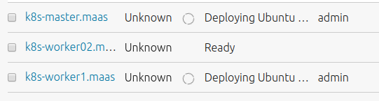

- Après  retournons sur MAAS en ssh et gardons un oeil sur le status du déploiement.

  ```
  julien@gustaviomaas:~$ juju switch k8s
  gustavio-maas:admin/default -> gustavio-maas:admin/k8s
  julien@gustaviomaas:~$ watch -c juju status --color
  Model  Controller     Cloud/Region   Version  SLA          Timestamp
  k8s    gustavio-maas  gustavio-maas  2.6.5    unsupported  00:53:15Z
  
  App                Version  Status   Scale  Charm              Store       Rev  OS      Notes
  containerd                  waiting      0  containerd         jujucharms    2  ubuntu  
  easyrsa                     waiting    0/1  easyrsa            jujucharms  254  ubuntu  
  etcd                        waiting    0/1  etcd               jujucharms  434  ubuntu  
  flannel                     waiting      0  flannel            jujucharms  425  ubuntu  
  kubernetes-master           waiting    0/1  kubernetes-master  jujucharms  700  ubuntu  exposed
  kubernetes-worker           waiting    0/1  kubernetes-worker  jujucharms  552  ubuntu  exposed
  
  Unit                 Workload  Agent       Machine  Public address  Ports  Message
  easyrsa/0            waiting   allocating  0/lxd/0                         waiting for machine
  etcd/0               waiting   allocating  0        192.168.48.4           waiting for machine
  kubernetes-master/0  waiting   allocating  0        192.168.48.4           waiting for machine
  kubernetes-worker/0  waiting   allocating  1        192.168.48.3           waiting for machine
  
  Machine  State    DNS           Inst id      Series  AZ       Message
  0        pending  192.168.48.4  k8s-master   bionic  default  Deploying: From 'Allocated' to 'Deploying'
  0/lxd/0  pending                pending      bionic           
  1        pending  192.168.48.3  k8s-worker1  bionic  default  Deploying: From 'Allocated' to 'Deploying'
  ```

- Le déploiement étant en cours, faisons quelques modifications:

  1. Rajoutons un 2e noeud worker k8s

     ```
     julien@gustaviomaas:~$ juju add-unit kubernetes-worker
     ```

  2. Rajoutons etcd sur les deux noeuds worker pour un etcd distribué en cas de panne.

     ```
     julien@gustaviomaas:~$ juju add-unit etcd -n2 --to 1,2
     ```

  3. Rajoutons ceph-mon sur les 3 machines k8s

     ```
     julien@gustaviomaas:~$ juju deploy ceph-mon -n3 --to 0,1,2
     Located charm "cs:ceph-mon-38".
     Deploying charm "cs:ceph-mon-38".
     ```

  4. Lorsque la plupart des tâches de déploiement sont finies, il est safe de déployer ceph-osd

     ```
     julien@gustaviomaas:~$ juju deploy ceph-osd -n3 --to 0,1,2
     Located charm "cs:ceph-osd-285".
     Deploying charm "cs:ceph-osd-285".
     julien@gustaviomaas:~$ juju add-relation ceph-osd ceph-mon
     ```

  5. Ceph étant déployer il faut rajouter des relations pour que le cluster K8s puisse l'utiliser

     ```bash
     juju add-relation ceph-mon:admin kubernetes-master
     juju add-relation ceph-mon:client kubernetes-master
     ```

- Allons maintenant chercher la config de kubectl sur le master avec un tunnel pour utiliser notre clef privé

  ```
  ssh -N mymaas -L 2222:192.168.48.9:22
  scp -P 2222 ubuntu@127.0.0.1:~/config ~/gustavio-k8s-config
  ```

- Rajouter la config dans votre ~/.kube/config et modifions là pour utiliser notre IP localhost - car nous contacterons le master par un tunnel ssh.    

  ```
  server: https://192.168.48.9:6443
  remplacé par:
  server: https://127.0.0.1:6443
  ```

 - Ouvrez un tunnel et essayez un tunnel - vous aurez une erreur de certificat

   ```
   ssh -N mymaas -L 6443:192.168.48.9:6443
   
   kubectl get pods
   Unable to connect to the server: x509: certificate is valid for 10.152.183.1, 192.168.48.9, not 127.0.0.1
   ```

- Pour y remedier, on peut changer la configuration sur MAAS avec Juju

  ```
  julien@gustaviomaas:~$ juju config kubernetes-master extra_sans="127.0.0.1"
  ```


Amusez-vous bien avec votre nouveau cluster !


## Pour supprimer notre déploiement

Nous n'avons qu'a supprimer notre modèle Juju, les 3 machines de notre déploiement retournerons en mode Ready.

```
julien@gustaviomaas:~$ juju destroy-model k8s
```


Ou pour détruire tout d'un coup - incluant le controlleur juju:

```
julien@gustaviomaas:~$ juju destroy-controller gustavio-maas --destroy-all-models
WARNING! This command will destroy the "gustavio-maas" controller.
This includes all machines, applications, data and other resources.

Continue? (y/N):y
Destroying controller
Waiting for hosted model resources to be reclaimed
All hosted models reclaimed, cleaning up controller machines
julien@gustaviomaas:~$ 
```

