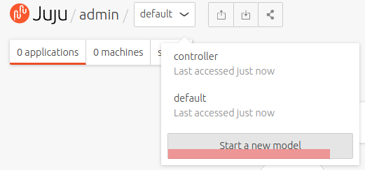
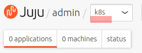
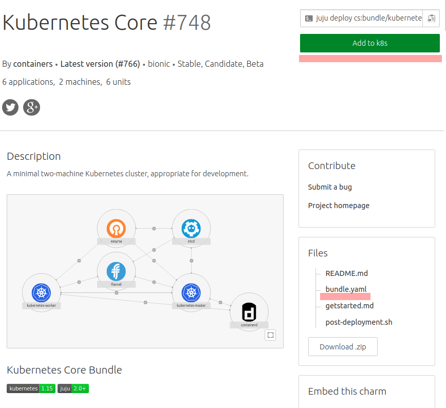

# Juju et déployer kubernetes


- Nous allons faire la plupart des prochaines commandes à partir de notre VM Maas, qui est accessible de l'externe. Connectez-vous en SSH. C'est une préférence personnelle, mais j'aime bien avoir un sudo sans mot de passe:

  ```
  julien@gustaviomaas:~$ sudo -i
  [sudo] password for julien: 
  root@gustaviomaas:~# 
  ```

  Modifier le fichier /etc/sudoers et changer la ligne en rajoutant NOPASSWD:

  ```
  %sudo   ALL=(ALL:ALL) NOPASSWD:ALL
  ```

- Installons ensuite le client juju

  ```
  julien@gustaviomaas:~$ sudo snap install juju --classic
  juju 2.6.5 from Canonical✓ installed
  julien@gustaviomaas:~$ 
  ```

- Rajoutons notre nouveau Cloud MAAS

  ```
  julien@gustaviomaas:~$ juju add-cloud
  Cloud Types
    lxd
    maas
    manual
    openstack
    vsphere
  
  Select cloud type: maas
  
  Enter a name for your maas cloud: gustavio-maas
  
  Enter the API endpoint url: http://192.168.48.254:5240/MAAS
  
  Cloud "gustavio-maas" successfully added
  
  You will need to add credentials for this cloud (`juju add-credential gustavio-maas`)
  before creating a controller (`juju bootstrap gustavio-maas`).
  julien@gustaviomaas:~$ 
  ```

- Il manque notre clef API que vous retrouverez dans MAAS en cliquant sur votre utilisateur admin:

  

  ```
  julien@gustaviomaas:~$ juju add-credential gustavio-maas
  Enter credential name: gustavio-maas-creds
  
  Using auth-type "oauth1".
  
  Enter maas-oauth: 
  
  Credential "gustavio-maas-creds" added locally for cloud "gustavio-maas".
  
  julien@gustaviomaas:~$
  ```

- Un controller Juju peut maintenant être déployer sur une de nos machines dans MAAS. Nous pouvons dire sur quelle machine nous voulons déployer le controller juju.

  ```
  julien@gustaviomaas:~$ juju bootstrap gustavio-maas --to gjuju.maas
  Creating Juju controller "gustavio-maas" on gustavio-maas
  Looking for packaged Juju agent version 2.6.5 for amd64
  Launching controller instance(s) on gustavio-maas...
  ```

  

  N'oublions pas d'allumer ensuite la VM

  

- MAAS installeras Ubuntu et Juju ira configurer le controller

  ```
  julien@gustaviomaas:~$ juju bootstrap gustavio-maas --to gjuju.maas
  Creating Juju controller "gustavio-maas" on gustavio-maas
  Looking for packaged Juju agent version 2.6.5 for amd64
  Launching controller instance(s) on gustavio-maas...
  
  - dg8dkr (arch=amd64 mem=4G cores=1)  
    Installing Juju agent on bootstrap instance
    Fetching Juju GUI 2.14.0
    Waiting for address
    Attempting to connect to 192.168.48.2:22
    Connected to 192.168.48.2
    Running machine configuration script...
    Bootstrap agent now started
    Contacting Juju controller at 192.168.48.2 to verify accessibility...
  
  Bootstrap complete, controller "gustavio-maas" now is available
  Controller machines are in the "controller" model
  Initial model "default" added
  julien@gustaviomaas:~$ 
  ```

- Le controller Juju à une interface web, retrouvons-là:

  ```
  julien@gustaviomaas:~$ juju gui
  GUI 2.14.0 for model "admin/default" is enabled at:
    https://192.168.48.2:17070/gui/u/admin/default
  Your login credential is:
    username: admin
    password: a6933655a8223098831cbd6c3d7486a7
  julien@gustaviomaas:~$ 
  ```

- Ouvrons un autre tunnel pour se connecter à l'interface web

  ```
  julien@laptop:~$ ssh -N mymaas -L 17070:192.168.48.2:17070
  ```

  

- Après s'être connecter, créeons un nouveau modèle pour notre déploiement



- Entrez un nom représentant ce que vous voulez faire



- Cliquez sur le gros + et choisissez Kubernetes-View et choisissez Kubernetes Core.

  Le fichier bundle.yaml permet de voir les contraintes (cpu/ram) que les machines ont besoins - petit truc.

  

- Après l'ajout vous aurez l'option de rajouter vos clefs publiques pour les connections SSH. IMPORTANT, car vous ne pourrez pas vous connecter au master et retrouver la config k8s.

  

- Lorsque ajouter, Juju télécharge le bundle/charm et est prêt à être déployer avec Deploy Changes. N'oublions de partir les VMs que MAAS/Juju ont choisit

  

- Après  retournons sur MAAS en ssh et gardons un oeil sur le status du déploiement.

  ```
  julien@gustaviomaas:~$ juju switch k8s
  gustavio-maas:admin/default -> gustavio-maas:admin/k8s
  julien@gustaviomaas:~$ watch -c juju status --color
  Model  Controller     Cloud/Region   Version  SLA          Timestamp
  k8s    gustavio-maas  gustavio-maas  2.6.5    unsupported  00:53:15Z
  
  App                Version  Status   Scale  Charm              Store       Rev  OS      Notes
  containerd                  waiting      0  containerd         jujucharms    2  ubuntu  
  easyrsa                     waiting    0/1  easyrsa            jujucharms  254  ubuntu  
  etcd                        waiting    0/1  etcd               jujucharms  434  ubuntu  
  flannel                     waiting      0  flannel            jujucharms  425  ubuntu  
  kubernetes-master           waiting    0/1  kubernetes-master  jujucharms  700  ubuntu  exposed
  kubernetes-worker           waiting    0/1  kubernetes-worker  jujucharms  552  ubuntu  exposed
  
  Unit                 Workload  Agent       Machine  Public address  Ports  Message
  easyrsa/0            waiting   allocating  0/lxd/0                         waiting for machine
  etcd/0               waiting   allocating  0        192.168.48.4           waiting for machine
  kubernetes-master/0  waiting   allocating  0        192.168.48.4           waiting for machine
  kubernetes-worker/0  waiting   allocating  1        192.168.48.3           waiting for machine
  
  Machine  State    DNS           Inst id      Series  AZ       Message
  0        pending  192.168.48.4  k8s-master   bionic  default  Deploying: From 'Allocated' to 'Deploying'
  0/lxd/0  pending                pending      bionic           
  1        pending  192.168.48.3  k8s-worker1  bionic  default  Deploying: From 'Allocated' to 'Deploying'
  ```

- Le déploiement étant en cours, faisons quelques modifications:

  1. Rajoutons un 2e noeud worker k8s

     ```
     julien@gustaviomaas:~$ juju add-unit kubernetes-worker
     ```

  2. Rajoutons etcd sur les deux noeuds worker pour un etcd distribué en cas de panne.

     ```
     julien@gustaviomaas:~$ juju add-unit etcd -n2 --to 1,2
     ```

  3. Rajoutons ceph-mon sur les 3 machines k8s

     ```
     julien@gustaviomaas:~$ juju deploy ceph-mon -n3 --to 0,1,2
     Located charm "cs:ceph-mon-38".
     Deploying charm "cs:ceph-mon-38".
     ```

  4. Lorsque la plupart des tâches de déploiement sont finies, il est safe de déployer ceph-osd

     ```
     julien@gustaviomaas:~$ juju deploy ceph-osd -n3 --to 0,1,2
     Located charm "cs:ceph-osd-285".
     Deploying charm "cs:ceph-osd-285".
     julien@gustaviomaas:~$ juju add-relation ceph-osd ceph-mon
     ```

  5. Ceph étant déployer il faut rajouter des relations pour que le cluster K8s puisse l'utiliser

     ```bash
     juju add-relation ceph-mon:admin kubernetes-master
     juju add-relation ceph-mon:client kubernetes-master
     ```

- Allons maintenant chercher la config de kubectl sur le master avec un tunnel pour utiliser notre clef privé

  ```
  ssh -N mymaas -L 2222:192.168.48.9:22
  scp -P 2222 ubuntu@127.0.0.1:~/config ~/gustavio-k8s-config
  ```

- Rajouter la config dans votre ~/.kube/config et modifions là pour utiliser notre IP localhost - car nous contacterons le master par un tunnel ssh.    

  ```
  server: https://192.168.48.9:6443
  remplacé par:
  server: https://127.0.0.1:6443
  ```

 - Ouvrez un tunnel et essayez un tunnel - vous aurez une erreur de certificat

   ```
   ssh -N mymaas -L 6443:192.168.48.9:6443
   
   kubectl get pods
   Unable to connect to the server: x509: certificate is valid for 10.152.183.1, 192.168.48.9, not 127.0.0.1
   ```

- Pour y remedier, on peut changer la configuration sur MAAS avec Juju

  ```
  julien@gustaviomaas:~$ juju config kubernetes-master extra_sans="127.0.0.1"
  ```


Amusez-vous bien avec votre nouveau cluster !


## Pour supprimer notre déploiement

Nous n'avons qu'a supprimer notre modèle Juju, les 3 machines de notre déploiement retournerons en mode Ready.

```
julien@gustaviomaas:~$ juju destroy-model k8s
```


Ou pour détruire tout d'un coup - incluant le controlleur juju:

```
julien@gustaviomaas:~$ juju destroy-controller gustavio-maas --destroy-all-models
WARNING! This command will destroy the "gustavio-maas" controller.
This includes all machines, applications, data and other resources.

Continue? (y/N):y
Destroying controller
Waiting for hosted model resources to be reclaimed
All hosted models reclaimed, cleaning up controller machines
julien@gustaviomaas:~$ 
```

