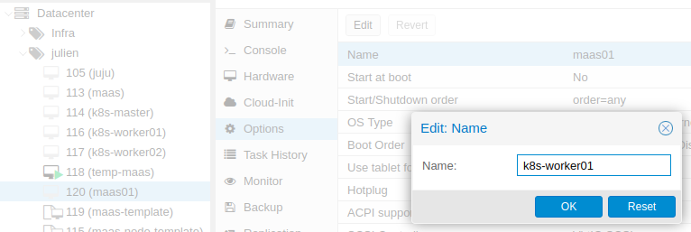

# Configuration de MAAS

Nous devons faire quelques configurations de base:

1. Laissez MAAS s'occuper de la distribution d'IP (DHCP)

   - Allez dans Subnet et cliquez sur le seul VLAN untagged

     

   - Cliquez sur le bouton X et choisissez Provide DHCP, entrez ensuite le range que vous désirez.

     

   - Rajoutons l'image de Centos 6/7 comme disponible pour le déploiements. Allez dans image et descendez à Other Images

     

   - MAAS est maintenant prêt. Rajoutons nos premières VMs. Dans Proxmox créer une VM que nous utiliserons comme template.

     

   - Choisissez "Do not use any media"

     

   - 80 Gb devrait être suffisant pour la plupart des OS

     

   - Pour les besoins des contraintes de cpu des modèles Juju, choisissez 4 core

     

   - 4096 Mb ou 4Gb de RAM

     

   - Mettez la VM dans le même réseau VMBR et le tag VLAN que MAAS

     

   - La VM créée nous devons faire encore une petite modification. Dans Options de la VM, mettez le Boot device 1 à Network

     

   - Nous allons ensuite transformer notre VM en template pour pouvoir dupliquer celle-ci facilement.

     

   - Par la suite la template peut-être cloné. Le mode Linked permet d'économiser de l'espace disque.

     

   - Profitons-en pour créer et modifier 4 VMs grâce à cette template:

     - 1x K8s master (2 core, 4Gb ram)

     - 2x K8s worker (4 core, 4Gb ram)

       - Rajouter un disque de 50Gb sur les 3 VMs K8s - ceci permettra de déployer Ceph HA

         

     - 1x Juju controller (1 core, 2Gb ram)

   - Démarrez une des nouvelles VMs et voyez la booter grace à MAAS !

     

   - La VM se fermera toute seule après la découverte par MAAS. Retournons à MAAS, nous verrons la nouvelle VM apparaître dans Machine. MAAS attribuera un nom aléatoire à votre machine.

     

     

     ###### Normalement l'étape de découverte de MAAS avec un serveur permet de découvrir sa carte BMC/IPMI pour pouvoir controller à distance l'ordinateur. Ce qui permettrais de tout controller à distance. Malheureusement pour une VM nous devons changer le mode à manuel et simuler le fait de devoir aller allumer le 'serveur' manuellement.

   - Dans la machine, allez dans l'onglet Configuration et changer le mode Power à Manual.

     

   - Nous allons ensuite sélectionner la machine et demander une Commission. Ceci permettrait d'analyser la machine pour connaître ses caractéristiques physiques. Gardez ensuite les paramètres par défaut pour la Commission.

     

     Le status changera à Commissioning

     

   - Normalement le serveur serait démarrez automatiquement avec IPMI ou une autre méthode automatique. Dans notre cas, nous devons aller ouvrir la VM manuellement.

     

   - Lorsque que le processus de Commission est terminé la machine s'éteint et sera Ready. Nous pouvons en profitez pour renommer la VM/machine selon son utilisation.

     

     Et dans Proxmox:

     

   - Répêter le processus, et vous devriez avoir 4 machines MAAS ready !