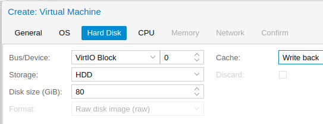

# Installation de MAAS sur Proxmox

Note: Tutoriel de l'installation et configuration de MAAS sur Proxmox.


## Installation de MAAS

Connectez vous à XXXXXXXXXXXXXXXXXXX

Username: XXXXXXXXXXXXXXXXXXX

Password: XXXXXXXXXXXXXXXXXXX  

- Créer une VM dans votre "resource pool" ou en appelant votre VM (ex. denis-maas)
  
    
- Choisissez VirtIO et Write Back pour les meilleurs performances
  
  
    
- Choisissez VMBR 8 - VLAN-MAAS et comme tag VLAN utilisez cette solution (votre âge + la jour de votre naissance x 10, ex. Gustavio 27 ans + 3 janvier * 7 = 48)  
    
- Finissez la création de la VM et démarrez celle-ci. La VM démarrera avec l'ISO d'installation.  
  Choisissez votre langue, et votre clavier. Installez ensuite MAAS en mode region  
    
- Choisissez un compte admin/mot de passe pour MAAS.  Configurez ensuite une IP statique avec le sous-réseau du même VLAN tag. Exemple: 192.168.48.0/24 (Gardons .1 pour le routeur/dns)  
  
- Continuez avec les valeurs par défaut. Pour le profile, entrez ce que vous désirez. Installez ensuite SSH et importez votre clef SSH si vous l'avez déjà dans GitHub.
  
- Ceci ne fonctionnera pas car votre réseau n'as pas encore de routeur... votre VM n'as donc pas accès à internet.


## Configuration de pfSense

Connectez vous à XXXXXXXXXXXXXXXXXXX 

Username: XXXXXXXXXXXXXXXXXXX 

Password: XXXXXXXXXXXXXXXXXXX  


- Dans la section VLANs, rajouter une interface VLAN avec l'interface parente vnet8 et votre VLAN tag. Entrez votre nom dans la description.  
  
- Dans la section Interface Assignment, rajouter une interface avec l'interface VLAN crée  
    
- Cliquez sur l'interface pour la configurer  
    
- Activer l'interface, donnez lui un nom, et choisissez la configuration IPv4 Static  
    
- Plus bas sur la page...  
  Entrez l'ip de votre routeur choisit pendant l'installation de MAAS (normalement .1) et votre sous-réseau /24, puis sauvegarder
  
- Allez dans les règles Firewall, dans votre interface, rajouter une règle:
  
- Changez le protocol pour Any et sauvegarder
  
- N'oubliez pas d'activer vos changements
  

- Dans Firewall/NAT, rajouter une règles de port-forwarding NAT.
  Nous ne rajouterons qu'une règle SSH, car nous pourrons tout faire par des tunnels SSH ensuite.
  


*Après les modifications dans pfSense, vous pourrez importez votre clef SSH de GitHub et terminez l'installation.*


## Configuration de base de MAAS

- Premièrement, connectons nous a notre VM Maas par SSH:
  

- Si tout marche bien, configurons ensuite notre ssh pour être plus rapide:

```
~/.ssh/config
Host mymaas
        Port 4822
        User julien
        HostName ocean.gologic.ca
```
- Maintenant pour accèder à l'interface web de notre Maas qui écoute sur le port 5240 par un tunnel SSH local:

  ```
  ssh -N mymaas -L 5240:127.0.0.1:5240
  ```

  

- Première configuration de MAAS:
  
- Cliquez sur continue. On peut ensuite importez nos clefs de compte GitHub pour que celles-ci soit disponible dans les VMs/Servers que nous allons gérer/déployer avec MAAS.


- MAAS est prêt, mais il reste du travail.
  

